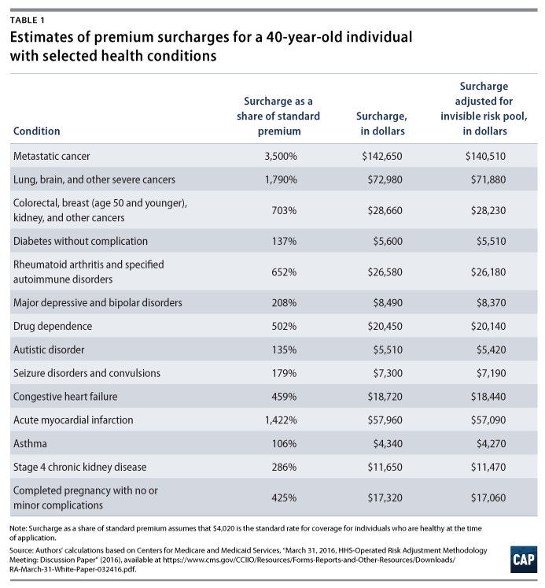

```{r setup, include=FALSE}
knitr::opts_chunk$set(echo = TRUE)
library(tidyverse)
library(readr)
library(ggpubr)
premiums <- read.csv("pre-existing-conditions-by-state.csv")

# install.packages("ggpubr") or check library(ggpubr) above to view graph 2.
```

***

## Introduction

"Nearly one dollar of every five we earn feeds the vast health care industry."[^1]  This is the reality we live with in modern day America.  Health care has become dominated by private companies whose sole purpose is to extort money from the people, which only helps to worsen the economic divide in the country.  The Affordable Care Act, signed into law by President Barack Obama, was one of the few steps taken to tide off the increasing power private insurance firms hold over peoples' lives.  However, this statute has been under fire and at risk of being repealed within the past four years.  If the Affordable Care Act were to be rolled back, insurance companies would be given free reign to either deny coverage to those with pre-existing conditions (outlawed by the ACA[^2]) or skyrocket their premiums and ultimately make them unable to pay for their insurance.  Even with the ACA, private insurance costs have still increased and pose a huge risk to everyone.  In order to stave off the increasing costs of insurance and ensure that those with preexisting conditions are able to continue living a normal life, the government must regulate the private insurance industry.


```{r age_percent, echo=FALSE, warning=FALSE}

options(scipen = 999)

premiums_melt <- premiums %>% gather(key = age, value = preexisting, X0_to_17_preexisting:X55_to_64_preexisting)

premiums_melt$preexisting <- as.numeric(as.character(premiums_melt$preexisting))

premiums_melt <- mutate(premiums_melt, cnt = c(1:n()))

premiums_melt$means_by_age <- with(premiums_melt, ave(preexisting, findInterval(cnt, c(1, 51, 102, 153,  204, 255, 306))))

ggplot(premiums_melt) +
  geom_col(aes(x=age, y=means_by_age, fill=age), show.legend = FALSE) +
  scale_y_continuous(limits=c(0, 700000), label = scales::comma_format()) +
  scale_x_discrete(labels = c("0-17", "18-24", "25-34", "35-44", "45-54", "55-64")) +
  labs(title = "Pre-Existing Conditions in the Non-Elderly", x = "Age", y = "# with Pre-existing Conditions")
  
```


## Health Care as a Service

The American Health Care Act, also referred to as AHCA, is a bill proposed in the past four years to repeal and replace the ACA, which explicitly protects Americans with pre-existing conditions from being discriminated against by the same insurance companies that cover them now.  The bill, if ratified, would allow these companies to judge an individual's past medical records to determine if they'll insure them.  This would put the over 130 million non-elderly Americans with pre-existing conditions[^3] at risk of losing coverage of their private insurance.  Along with this, it also shows the shocking trend that the largest age group with pre-existing conditions happens to be one of the youngest too.  If insurance companies knew that, especially, a young customer had a deadly form of cancer or a chronic illness, their yearly premiums would soar to ridiculous numbers.  Either that or they would simply be dropped from their plan, left to pay for the tens of thousands of dollars in expenses out of their own pocket.  Over 600,000 young people just starting their adult lives, some with obscene amounts of college debt, could face this shocking reality soon.  Aside from just the young people, this simply isn't feasible for most people in America, since the average household income in 2019 was only $35,977.[^4]


## Insurance Costs With and Without Pre-existing Conditions Protections
```{r premiums, echo=FALSE}

options(scipen = 999)

premiums$insurance_cost_2019 <- as.numeric(as.character(premiums$insurance_cost_2019))
premiums$insurance_cost_preexisting_2019 <- as.numeric(as.character(premiums$insurance_cost_preexisting_2019))

# Had to divide outcome by 5 so that the costs aren't combined on the axes, and the graph shows the average of the five states.
col1 <- ggplot(premiums) +
  geom_col(aes(y = cut_number(state_num, 10), x = insurance_cost_2019/5), fill = "#5373ff") + 
  scale_x_continuous(name = "Average Insurance Cost, in $, 2019", limits = c(0, 60000), label = scales::comma_format()) + 
  scale_y_discrete(labels = c("AL-CO", "CT-GA", "HI-IA", "KS-MD", "MA-MO", "MT-NJ", "NM-OH", "OK-SC", "SD-VT", "VA-WY")) +
  labs(y = "States")
  

col2 <- ggplot(premiums) + 
  geom_col(aes(y = cut_number(state_num, 10), x = insurance_cost_preexisting_2019/5), fill = "#ffa053") +
  scale_x_continuous(label = scales::comma_format()) +
   scale_y_discrete(labels = c("AL-CO", "CT-GA", "HI-IA", "KS-MD", "MA-MO", "MT-NJ", "NM-OH", "OK-SC", "SD-VT", "VA-WY")) +
  labs(x = "Predicted Insurance Cost w/ Pre-Existing Conditions, in $, 2019", y = "States")


(colfigure <- ggarrange(col1, col2, nrow = 2))

```


With this graph, the states and DC are arranged in alphabetical order, with 1 representing Alabama, 2 representing Alaska, and so on.  These are grouped to show the annual insurance cost of those states averaged together for 2019 with and without the current protections given by the ACA over pre-existing conditions.  This increase for pre-existing conditions was averaged from numbers provided by the Center for American Progress[^5] over various ailments.  These different conditions, ranging from depression to metastatic cancer, ended up with an average surcharge (increase in payment) percentage of 750.29% of an individual's normal premium cost.  This increase is clearly nowhere near feasible for almost every American, given the earlier-mentioned individual income per year.  If deregulation does happen, it would be disastrous for the ones who are most vulnerable.


{#surcharge}

##### [Source (Footnote Reference 5)](https://www.americanprogress.org/issues/healthcare/news/2017/04/20/430858/latest-aca-repeal-plan-explode-premiums-people-pre-existing-conditions/)


## Algorithms in the Insurance Industry

It's no secret that algorithms are becoming increasingly relevant in all business fields in the modern world.  They're used to predict our advertisements, loan risk, among countless other things.  And they also apply to the insurance industry.  Although health insurance examples are hard to find, life insurance policies from John Hancock have been completely overhauled within the past few years.  Instead of determining premiums based off of the obvious factors like health and employment history, they have started incorporating more algorithms into their calculations by "offering coverage priced according to interactions with policyholders through wearable health devices, smartphone apps, and websites."[^6]  


If this is already happening with life insurance, it's a guarantee that health insurance companies are starting to take the same exact approach.  Whether it be through harvesting personal data or other means, risk calculation for private insurance will become appallingly oppressive if paired with the inhumane and unfair tendencies of predictive algorithms.  As shown in *Weapons of Math Destruction*, algorithms have a tendency to discriminate, and pre-existing conditions factored in as a vector for risk would skyrocket rates for the most vulnerable 130 million Americans with these conditions.  If the Affordable Care Act is rolled back and people are left at the mercy of private health care and their algorithms, all Americans will suffer greatly.  The only way these algorithms can be controlled is if the federal government protects its people from crippling yearly charges by upholding the ACA and forcing transparency in the predictive algorithms guaranteed to become prominent in private health insurance.

***

## Bibliographic Material/References

This dataset was retrieved from three main sources.  The data for the average premium cost per year in 2019 was provided by the Kaiser Family Foundation at [this link](https://www.kff.org/other/state-indicator/single-coverage/?dataView=0&currentTimeframe=0&selectedDistributions=total-annual-premium&sortModel=%7B%22colId%22:%22Location%22,%22sort%22:%22asc%22%7D)[^7].  Along with this, the picture and percentage data used to calculate the % increase in health care costs without ACA protections was provided [here and at reference 5](https://www.americanprogress.org/issues/healthcare/news/2017/04/20/430858/latest-aca-repeal-plan-explode-premiums-people-pre-existing-conditions/).  And finally, the data pertaining to the portions of people with pre-existing conditions per state was compiled from [this dataset](https://data.world/carlvlewis/pre-exisiting-conditions-by-state-congressional-district) (footnote reference 3), which was created by estimating the numbers given by the Congressional Budget Office.


<!-- Footer -->

[^1]: O'Neil, Cathy.  *Weapons of Math Destruction*.  Crown Random House, 2016.

[^2]: [HHS.gov on Obamacare, Pre-existing Conditions](https://www.hhs.gov/healthcare/about-the-aca/pre-existing-conditions/index.html)

[^3]: [(Dataset) Preexisting Conditions by State, Congressional District](https://www.americanprogress.org/issues/healthcare/news/2017/04/05/430059/number-americans-pre-existing-conditions-congressional-district/)

[^4]: [Federal Reserve Bank of St. Louis Personal Income Statistics, 1975-2019](https://fred.stlouisfed.org/series/MEPAINUSA672N)

[^5]: ["Latest ACA Repeal Plan Would Explode Premiums for People with Pre-Existing Conditions", with Calculations Based off of Centers for Medicare and Medicaid Services Reports](https://www.americanprogress.org/issues/healthcare/news/2017/04/20/430858/latest-aca-repeal-plan-explode-premiums-people-pre-existing-conditions/)

[^6]: [Algorithms and AI Are Radically Changing Insurance. Regulators Are Behind the Curve](https://promarket.org/2019/06/05/algorithms-and-ai-are-radically-changing-insurance-regulators-are-behind-the-curve/)

[^7]: [(Dataset) Average Annual Single Premium per Enrolled Employee For Employer-Based Health Insurance](https://www.kff.org/other/state-indicator/single-coverage/?dataView=0&currentTimeframe=0&selectedDistributions=total-annual-premium&sortModel=%7B%22colId%22:%22Location%22,%22sort%22:%22asc%22%7D)
